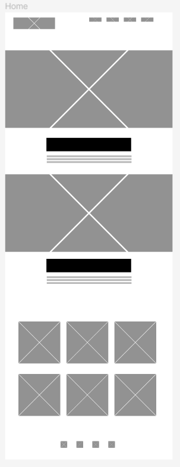
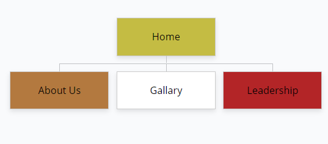

#ITIS 3135 Project Design Document

> **Website for the Beta Phi**\
> **Chapter of La Unidad Latina Lambda Upsilon Lambda**\
> **Fraternity Inc.**

***Diego Lopez***

***2/19/2024***

ITIS 3135 Project Design
Document{width="1.5in"
height="4in"}

> **Project Name: Beta Phi Chapter of La Unidad Latina Lambda Upsilon
> Lambda**
>
> **Fraternity Inc. Website**
>
> **Project Overview:**\
> Create a website for the Beta Phi Chapter of La Unidad Latina Lambda
> Upsilon Lambda Fraternity Inc. Intended users of the website will
> include: Members of the fraternity, Members of other geek
> organizations, Students interested in joining the organization, and
> University members curious about the organization among other
> stakeholders.
>
> **Site Map:**\
> Here is the sitemap for my application using . Inspired by
>
> [All pages will be linked by a navigation bar in the header of every
> page.]{.underline}

{width="5.5in"
height="2.5in"}

> **Page Design \[[Home Page]{.underline}\]:**\
> Here is the **home** page listed in my site map, provided *the
> following notes* to fulfill the requirements:
>
> ● The home page\
> ● This will be the landing page for the website to introduce the user
> to the organization.
>
> ● The user will need to be able to understand what the website is
> about, the administrator should be able to change the images on this
> page to maintain the currency for the organization.